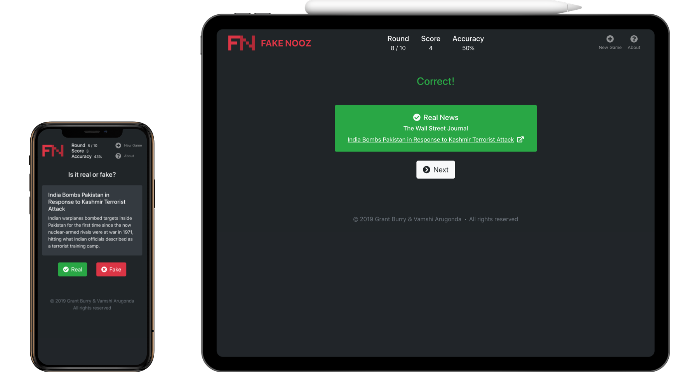

<h1 align="center">
    
     
    FAKE NOOZ
     
</h1>

<h4 align="center">
    CSCI 4849: Project 1
</h4>

FAKE NOOZ is a simple game to test how well you can determine what is real news apart from fake news. We're not really talking about fake news here—content which is designed to deceive you—instead our fake news sources are parody/satire sites that don't hesitate to acknowledge their work as comedy. Here are all the news and parody RSS feeds we use for FAKE NOOZ:

| Source                  | Type | Site                                      | RSS Feed                                                      |
|-------------------------|------|-------------------------------------------|---------------------------------------------------------------|
| The Onion               | Fake | [🌐](https://www.theonion.com)| [📰](https://www.theonion.com/rss)|
| Make America The Best   | Fake | [🌐](http://makeamericathebest.com)| [📰](http://makeamericathebest.com/feed/)|
| The Babylon Bee         | Fake | [🌐](https://babylonbee.com)| [📰](https://babylonbee.com/feed)|
| The Wall Street Journal | Real | [🌐](https://www.wsj.com/news/world)| [📰](https://www.wsj.com/xml/rss/3_7085.xml)|
| The New York Times      | Real | [🌐](https://www.nytimes.com)| [📰](http://rss.nytimes.com/services/xml/rss/nyt/HomePage.xml)|
| NPR News                | Real | [🌐](https://www.npr.org/sections/news)    | [📰](https://www.npr.org/rss/rss.php?id=1001)|
| Reddit » /r/nottheonion | Real | [🌐](https://www.reddit.com/r/nottheonion) | [📰](https://www.reddit.com/r/nottheonion/.rss)|

Our first thought for this project was to design a game and we went through a few different ideas before settling on FAKE NOOZ. Vamshi came up with the idea while reading through /r/NotTheOnion (Reddit.com)  which posts articles that sound like they would be fake but are in fact real. From there we decided to develop this into an app/game that people can test to see if the crazy stuff we hear in the news these days is real or just satire. Our app was designed to be responsive across multiple devices so it responds to varying device widths and looks as good on mobile as it does on a desktop browser. We’ve also incorporated two primary input methods, swiping for mobile users and clicking as the default functionality. Vamshi primarily designed the layout and design of the app and pushed for us to include a mobile version. Initially our intent was to construct the whole app in standard html, css, and js but on Grant’s suggestion we decided to code our app based on create-react-app. Because Vamshi isn't as familiar with node.js, nearly all the code was done while we worked together on Grant’s desktop. Grant implemented the gameplay mechanics and basic app structure. Grant also found and incorporated all of the front-end javascript frameworks. Vamshi found and collected the RSS metadata to feed articles into our app and also wrote the regex to strip the articles of pictures and information that would give away the article sources in-game. 

### [Development](DEVELOPMENT.md)
